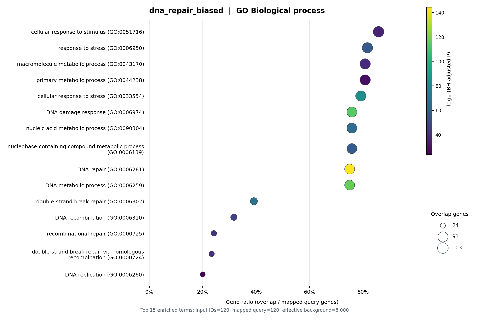

# GO Enrichment Skill

[](https://github.com/Sculptor815/go-enrichment-skill/actions/workflows/tests.yml)
[](requirements.txt)
[](LICENSE)

**From gene lists to auditable GO enrichment tables and figures, locally.**

A reusable agent skill and standalone Python command-line tool for Gene Ontology **over-representation analysis (ORA)**. Supply one or more gene lists and an experimental background; get identifier audits, BH-adjusted statistics and PNG/PDF dot plots. The original gene-expression-program loading workflow is also supported.

[中文说明](README.zh-CN.md) · [Skill instructions](SKILL.md) · [Statistical methods](references/analysis.md) · [Example results](examples/results/summary.csv)

## A real run on synthetic inputs

These figures are generated by the analysis code using public GO/NCBI annotations. The inputs are **simulated**, not experimental results: 6,000 randomly sampled human protein-coding background genes and four 120-gene lists, with seed **815**.

| List | Sampling design | Purpose |
|---|---|---|
| `random_control_1` | Uniform random sample from background | Show a null-style control, including nonsignificant outcomes |
| `random_control_2` | A second uniform sample | Show sampling variability |
| `immune_biased` | 90 immune-system-process genes + 30 genes outside that category | Illustrate a deliberately enriched example |
| `dna_repair_biased` | 90 DNA-repair genes + 30 genes outside that category | Illustrate a second functional theme |




The biased lists are drawn using the same annotations later used for testing. They demonstrate the workflow and visualization, **not independent biological discoveries**. Random controls are retained regardless of their results; no seed is selected to force significance or nonsignificance. Browse [all tables and figures](examples/results), [input gene lists](examples/inputs), and [sampling/data provenance](examples/provenance.json).

## Quick start: an offline demonstration

Python 3.10 or newer is required. Run from the repository root:

```sh
git clone https://github.com/Sculptor815/go-enrichment-skill.git
cd go-enrichment-skill
python -m venv .venv
```

Activate the environment with `source .venv/bin/activate` on macOS/Linux, or `.venv\Scripts\Activate.ps1` in Windows PowerShell. Then:

```sh
python -m pip install -r requirements.txt
python scripts/run_demo.py --out demo-results
```

The demo uses the included annotation snapshot and makes **no network requests**. Use `requirements-demo.txt` to match the four core library versions used for the committed results. Numerical tables should reproduce with the snapshot; timestamps, paths, PDF metadata and image rendering can differ across environments. Use a new or empty output directory each time.

## Analyze your own genes

Prepare `genes.txt` and `background.txt`, each with one identifier per line and no header. The background is the set of genes that could have been selected in your experiment, not just the selected genes. Symbols, Ensembl gene IDs and Entrez IDs are accepted, with ambiguous mappings reported separately.

Download full public annotations once:

```sh
python scripts/go_enrichment.py download --taxid 9606 --out annotation-cache
```

The all-species NCBI `gene2go.gz` can exceed 1 GB. Downloads support bounded retries and resume partial transfers; completed files are reused only when source URLs and checksums match. Alternatively supply existing `go-basic.obo`, `gene_info` and `gene2go` files directly. NCBI inputs may be plain text or gzip. The scripts only request public annotations; query data are processed locally.

```sh
python scripts/go_enrichment.py analyze --query treated=genes.txt --background background.txt --taxid 9606 --obo annotation-cache/go-basic.obo --gene-info annotation-cache/gene_info.gz --gene2go annotation-cache/gene2go.gz --out results/treated
```

Useful options:

| Option | Use |
|---|---|
| `--query control=control.txt --query treated=treated.txt` | Analyze multiple lists against the same background |
| `--column gene --background-column gene` | Select named columns in CSV/TSV inputs; omit separately for TXT |
| `--aspects BP MF CC` | Choose GO aspects; default is all three |
| `--fdr 0.05 --min-term-size 10 --max-term-size 2000` | Set correction threshold and background-based term-size limits |
| `--top-terms 15 --dpi 300` | Adjust significant-term plots; all tested terms are still saved |
| `--exclude-evidence ND IEA` | Exclude ND and electronic annotations; default excludes ND only |
| `--outside-background drop` | Explicitly exclude mapped query genes outside background; default is an error |
| `--no-plots` | Write statistics without figures |

Human (`9606`), mouse (`10090`) and rat (`10116`) have built-in gene_info download URLs. For other organisms supported by NCBI gene2go, supply a compatible local gene_info file or `download --gene-info-url URL`. The committed biological demonstration is **human only**; check annotation coverage for your organism.

**Do not use `examples/annotations/` for arbitrary input lists.** That snapshot is intentionally restricted to the example background. Use complete species-compatible annotations for real analyses.

## Gene-expression-program loading matrices

To retain the original workflow, supply a CSV whose first column contains gene IDs and other columns contain nonnegative program loadings:

```sh
python scripts/go_enrichment.py analyze --loading loadings.csv --z-threshold 3 --taxid 9606 --obo annotation-cache/go-basic.obo --gene-info annotation-cache/gene_info.gz --gene2go annotation-cache/gene2go.gz --out results/programs
```

The tool calculates each gene's Z score across **all** program columns (`ddof=1`), selects strictly Z > threshold, and uses all input matrix genes as background. Constant rows get Z=0. Use `--program GEP_000` repeatedly to limit analyzed programs without changing the Z-score calculation. Z > 3 cannot select genes with 10 or fewer program columns; see [methods](references/analysis.md#loading-matrices). The Z score is a descriptive selection rule, not a statistical test.

## Install as an agent skill

The repository root is the skill directory: `SKILL.md`, `scripts/`, `references/`, and `agents/openai.yaml` travel together. For Codex, clone into your skills directory instead of the working directory:

```sh
git clone https://github.com/Sculptor815/go-enrichment-skill.git ~/.codex/skills/go-enrichment-skill
```

If your Codex home is customized, use its `skills` directory. Install `requirements.txt` into the Python environment that will execute the scripts, then start a new session and invoke:

> Use $go-enrichment-skill to analyze my human gene lists against background.txt and generate GO BP/MF/CC enrichment tables and plots.

The agent should establish the organism and experimental background, run the tool, inspect the mapping/coverage audits and explain the results. The skill is automatically discoverable as well as explicitly invocable. The CLI works without an agent or API key.

## What is saved

```text
results/treated/
  settings.json              Parameters, hashes, ontology version, software versions, status
  summary.csv                Query/aspect sizes and significant-term counts
  annotation_coverage.csv    Background coverage and candidate counts
  mapping/                   Background/query mapping audits and unknown GO IDs
  gene_lists/                Submitted or Z-selected genes and included GeneIDs
  tables/                    All tested terms and significant-only tables
  plots/                     PNG, vector PDF and exact plotted-term CSVs
  plot_failures.csv           Plot error details, if any
```

The one-sided hypergeometric test uses unique mapped IDs; mapped genes lacking annotations remain in the background/query denominators. GO annotations propagate through `is_a` and `part_of`. BH correction is separate for each query × aspect and includes zero-hit candidates. Significant means adjusted p < threshold and fold enrichment > 1. These choices preserve the source workflow; [methods](references/analysis.md) describes their implications and limitations.

Enrichment does not establish activation or repression. No significant terms is a valid result. This is **ORA, not ranked GSEA**. GO terms overlap and related hits are not independent discoveries.

## Rebuild examples and run tests

Create new seeded inputs and a snapshot from full annotations, then pass the resulting input and annotation paths to `analyze`:

```sh
python scripts/make_demo.py --obo annotation-cache/go-basic.obo --gene-info annotation-cache/gene_info.gz --gene2go annotation-cache/gene2go.gz --seed 815 --out new-examples
python -m unittest discover -s tests -v
```

Generating from a newer annotation release can change the sampled universe and results even with the same seed. Use the committed snapshot for the published example. Tests check statistical tails, BH correction, identifier handling, annotation propagation, empty cases, output protection, plots and resumable downloads. GitHub Actions runs them on Linux and Windows with Python 3.10 and 3.12.

## Attribution and license

Adapted from the author's original GEP Z-score GO enrichment workflow. Source code: [MIT](LICENSE). Third-party GO/NCBI data and derived example content retain their respective terms; see [NOTICE.md](NOTICE.md). Refer to the [GO enrichment guide](https://geneontology.org/docs/go-enrichment-analysis/), [ontology documentation](https://geneontology.org/docs/download-ontology/) and [GO citation policy](https://geneontology.org/docs/go-citation-policy/) when reporting analyses.
