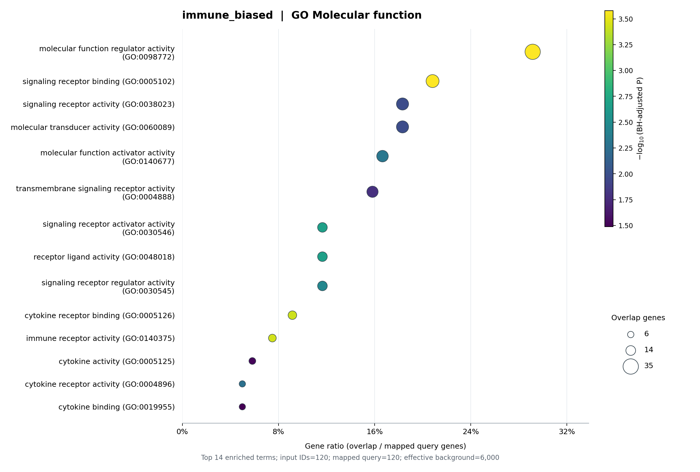
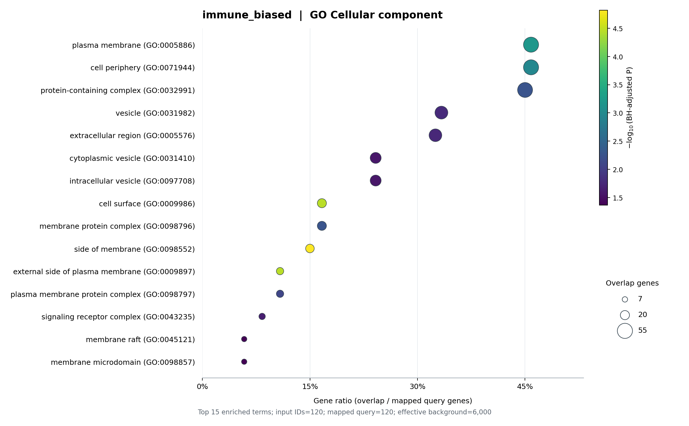

# GO Enrichment Skill

A Codex skill for local Gene Ontology enrichment analysis. Turn a gene list into BP, MF and CC dot plots, statistical tables and a concise interpretation.

## Install

Requires Python 3.10+.

```sh
git clone https://github.com/Sculptor815/go-enrichment-skill.git ~/.codex/skills/go-enrichment-skill
python -m pip install -r ~/.codex/skills/go-enrichment-skill/requirements.txt
```

For a custom `CODEX_HOME`, use its `skills` directory. Start a new conversation after installation.

## Use

Attach a gene-list file or paste the gene names, then ask:

> Use $go-enrichment-skill to analyze this gene list, generate BP, MF and CC dot plots, and briefly explain the results.

Human is the default; specify other organisms in your prompt. The skill prepares annotations and runs the analysis locally. Initial annotation downloads may exceed 1 GB.

> **Background matters.** Prefer all genes eligible for selection in your experiment, such as all genes tested for differential expression. If none is supplied, the skill uses GO-annotated genes as the background; this choice affects enrichment results.

## Example results

Actual outputs from an immune-biased synthetic gene list, shown for demonstration.

### BP · Biological process


| GO ID | Term | P value | BH-adjusted P value |
|---|---|---:|---:|
| GO:0002376 | immune system process | 1.101e-70 | 3.139e-67 |
| GO:0006955 | immune response | 2.424e-50 | 3.455e-47 |
| GO:0002682 | regulation of immune system process | 1.385e-30 | 1.317e-27 |
| GO:0009605 | response to external stimulus | 5.616e-20 | 1.779e-17 |
| GO:0006952 | defense response | 2.655e-24 | 9.463e-22 |
| GO:0050776 | regulation of immune response | 1.266e-27 | 9.027e-25 |
| GO:0002684 | positive regulation of immune system process | 1.623e-24 | 6.612e-22 |
| GO:0044419 | biological process involved in interspecies interaction between organisms | 1.327e-18 | 2.702e-16 |
| GO:0032101 | regulation of response to external stimulus | 2.691e-19 | 7.671e-17 |
| GO:0043207 | response to external biotic stimulus | 1.059e-18 | 2.324e-16 |
| GO:0051707 | response to other organism | 1.059e-18 | 2.324e-16 |
| GO:0001775 | cell activation | 1.283e-25 | 6.096e-23 |
| GO:0045321 | leukocyte activation | 3.002e-27 | 1.711e-24 |
| GO:0031347 | regulation of defense response | 1.001e-18 | 2.324e-16 |
| GO:0140546 | defense response to symbiont | 2.593e-18 | 4.928e-16 |

### MF · Molecular function



| GO ID | Term | P value | BH-adjusted P value |
|---|---|---:|---:|
| GO:0098772 | molecular function regulator activity | 4.961e-07 | 2.630e-04 |
| GO:0005102 | signaling receptor binding | 8.526e-07 | 2.630e-04 |
| GO:0038023 | signaling receptor activity | 1.895e-04 | 1.063e-02 |
| GO:0060089 | molecular transducer activity | 1.895e-04 | 1.063e-02 |
| GO:0140677 | molecular function activator activity | 6.253e-05 | 4.823e-03 |
| GO:0004888 | transmembrane signaling receptor activity | 3.251e-04 | 1.672e-02 |
| GO:0030546 | signaling receptor activator activity | 2.089e-05 | 2.148e-03 |
| GO:0048018 | receptor ligand activity | 1.851e-05 | 2.148e-03 |
| GO:0030545 | signaling receptor regulator activity | 3.939e-05 | 3.472e-03 |
| GO:0005126 | cytokine receptor binding | 2.445e-06 | 3.772e-04 |
| GO:0140375 | immune receptor activity | 1.771e-06 | 3.641e-04 |
| GO:0005125 | cytokine activity | 6.378e-04 | 3.027e-02 |
| GO:0004896 | cytokine receptor activity | 7.906e-05 | 5.420e-03 |
| GO:0019955 | cytokine binding | 7.353e-04 | 3.241e-02 |

### CC · Cellular component



| GO ID | Term | P value | BH-adjusted P value |
|---|---|---:|---:|
| GO:0005886 | plasma membrane | 5.424e-06 | 6.441e-04 |
| GO:0071944 | cell periphery | 1.131e-05 | 1.075e-03 |
| GO:0032991 | protein-containing complex | 7.459e-05 | 5.467e-03 |
| GO:0031982 | vesicle | 3.132e-04 | 1.653e-02 |
| GO:0005576 | extracellular region | 3.716e-04 | 1.765e-02 |
| GO:0031410 | cytoplasmic vesicle | 6.958e-04 | 2.705e-02 |
| GO:0097708 | intracellular vesicle | 7.404e-04 | 2.705e-02 |
| GO:0009986 | cell surface | 2.021e-07 | 3.486e-05 |
| GO:0098796 | membrane protein complex | 8.057e-05 | 5.467e-03 |
| GO:0098552 | side of membrane | 3.198e-08 | 1.519e-05 |
| GO:0009897 | external side of plasma membrane | 2.202e-07 | 3.486e-05 |
| GO:0098797 | plasma membrane protein complex | 1.382e-04 | 8.204e-03 |
| GO:0043235 | signaling receptor complex | 5.058e-04 | 2.184e-02 |
| GO:0045121 | membrane raft | 1.269e-03 | 4.305e-02 |
| GO:0098857 | membrane microdomain | 1.362e-03 | 4.312e-02 |

Also available as a Python CLI: `python scripts/go_enrichment.py --help`.

[MIT license](LICENSE) · [Data sources and licenses](NOTICE.md)
