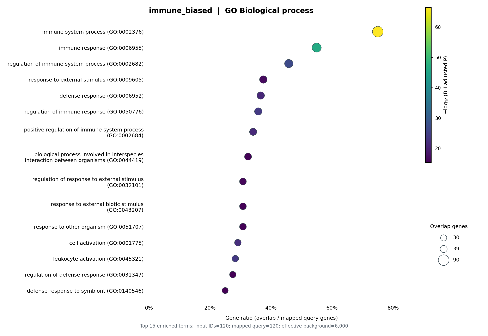

# GO Enrichment Skill

**从 gene list 到可追溯的 GO 富集结果，全程本地分析。**

这是一个可直接运行的 Python 工具，也可以作为 Codex Skill 使用。支持单个或多个基因列表、自定义背景，以及原来的 gene × GEP loading 矩阵输入；输出基因映射审计、完整统计表和 PNG/PDF 气泡图。

[English](README.md) · [统计方法](references/analysis.md) · [示例结果](examples/results/summary.csv) · [Skill 定义](SKILL.md)

## 先运行离线示例

需要 Python 3.10 或更新版本。下载仓库并进入目录，在所选 Python 环境中执行：

```sh
python -m pip install -r requirements.txt
python scripts/run_demo.py --out demo-results
```

示例所需的精简注释已随仓库提供，分析过程无需联网。要匹配已发布示例的核心依赖版本，可安装 `requirements-demo.txt`。每次使用新的或空的输出文件夹，已有结果不会被覆盖。

示例固定随机种子为 **815**，从人类蛋白编码基因中随机选择 6,000 个作为模拟背景，并生成四个各含 120 个基因的列表：

| 列表 | 生成方式 |
|---|---|
| `random_control_1` | 从背景均匀随机抽取 120 个基因 |
| `random_control_2` | 第二组均匀随机抽样 |
| `immune_biased` | 90 个免疫系统过程相关基因 + 30 个该类别外基因 |
| `dna_repair_biased` | 90 个 DNA 修复相关基因 + 30 个该类别外基因 |



这些是**模拟输入、实际运行得到的结果**。两个功能偏向列表依据 GO 注释构建，只用于演示，不构成独立的生物学发现。随机对照不会为了得到显著或不显著结果而重新抽样。[生成规则与注释哈希](examples/provenance.json)均公开保存。

## 分析自己的 gene list

准备两个 TXT 文件，每行一个基因 ID，不要表头：`genes.txt` 为目标列表，`background.txt` 为实验中有机会被选入目标列表的全部基因。支持 symbol、Ensembl gene ID、Entrez GeneID。

首次下载公开注释：

```sh
python scripts/go_enrichment.py download --taxid 9606 --out annotation-cache
```

完整 NCBI `gene2go.gz` 可能超过 1 GB，支持断点续传和校验。也可直接使用已有文件。网络只用于下载公开注释；分析脚本不会上传基因列表。

```sh
python scripts/go_enrichment.py analyze --query sample=genes.txt --background background.txt --taxid 9606 --obo annotation-cache/go-basic.obo --gene-info annotation-cache/gene_info.gz --gene2go annotation-cache/gene2go.gz --out results/sample
```

- 批量分析：重复添加 `--query 名称=文件路径`。
- CSV/TSV：用 `--column gene` 指定目标表的基因列，`--background-column gene` 指定背景表的基因列。
- 选择 GO 分支：`--aspects BP` 或 `--aspects BP MF CC`。
- 绘图：`--top-terms 15 --dpi 300`；完整统计结果不受绘图数量限制。
- 物种：人类 `9606`、小鼠 `10090`、大鼠 `10116` 有内置下载地址；其他物种需要提供兼容的 NCBI 文件。仓库的生物学示例目前仅验证了人类。

**不要把 `examples/annotations/` 用于自己的任意基因列表。** 它仅包含演示背景所需的注释，真实分析应使用完整的物种注释。

## 保留原来的 GEP 分析方式

```sh
python scripts/go_enrichment.py analyze --loading loadings.csv --z-threshold 3 --taxid 9606 --obo annotation-cache/go-basic.obo --gene-info annotation-cache/gene_info.gz --gene2go annotation-cache/gene2go.gz --out results/geps
```

输入是第一列为基因、其余列为非负 program loading 的 CSV。按每个基因在全部 program 间的均值和样本标准差计算 Z（`ddof=1`），严格选择 Z > 阈值，全部输入基因作为背景。`--program GEP_000` 仅限制分析哪些 program，不改变 Z 的计算范围。program 数量不超过 10 时，Z > 3 在数学上无法达到；工具不会擅自降低阈值。

## 安装为 Skill

把完整仓库放入 Codex 的 skills 目录，例如：

```sh
git clone https://github.com/Sculptor815/go-enrichment-skill.git ~/.codex/skills/go-enrichment-skill
```

如果配置了自定义 Codex home，请使用对应的 `skills` 目录。安装 Python 依赖后，在新会话中使用：

> 使用 $go-enrichment-skill，分析我的人类基因列表，以 background.txt 为背景，生成 GO BP/MF/CC 富集表和图。

## 结果怎么看

先看 `summary.csv` 和 `annotation_coverage.csv`，再检查 `mapping/` 中未映射、歧义和背景外基因。`tables/` 保存全部及显著条目，`plots/` 保存 PNG、矢量 PDF 和准确的作图条目。`settings.json` 记录版本、参数、哈希和运行状态。

统计方法为单侧超几何检验，按**每个列表 × 每个 GO 分支**分别进行 BH 校正，零命中候选条目也参与校正。重复映射到同一 Entrez ID 的输入只计数一次；能映射但没有 GO 注释的基因保留在分母中。默认拒绝背景外目标基因，只有显式指定 `--outside-background drop` 才会记录后排除。

没有显著结果也是有效结果。GeneRatio 是命中基因数/有效目标基因数，不是 FoldEnrichment；富集不能直接说明功能激活或抑制。本工具实现 ORA，不是对排序基因列表做 GSEA。

源码使用 [MIT 许可](LICENSE)；GO/NCBI 数据及衍生结果的来源和许可见 [NOTICE.md](NOTICE.md)。
