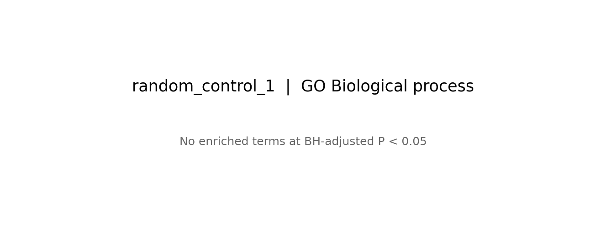

# Reproducible synthetic demonstration

Run `python scripts/run_demo.py --out demo-results` from the repository root after installing the Python dependencies. No annotation downloads are needed.

- Organism: Homo sapiens, NCBI taxonomy ID 9606.
- Seed: 815; background: 6,000 uniformly sampled protein-coding genes.
- Each query: 120 unique Entrez GeneIDs.
- Ontology: `releases/2026-07-26`; original and subset hashes: [provenance.json](provenance.json).
- Test: hypergeometric ORA; BH correction per list × GO aspect; adjusted p < 0.05.
- Candidate term size: 10–2000 background genes; 2,851 BP, 617 MF and 475 CC terms.

| Synthetic list | Significant BP | Significant MF | Significant CC |
|---|---:|---:|---:|
| Uniform random control 1 | 0 | 0 | 0 |
| Uniform random control 2 | 0 | 0 | 0 |
| Immune-biased | 400 | 14 | 15 |
| DNA-repair-biased | 166 | 71 | 38 |

The biased lists use 90 category members and 30 genes outside the category. They are intentionally constructed to show enrichment and are not independent discoveries. The two uniform controls were retained without result-based resampling. These counts describe this snapshot and seed only; they are not a guarantee for other random lists.

[Input lists](inputs) · [Summary](results/summary.csv) · [Complete tables](results/tables) · [All plots](results/plots)

The bundled annotation files are filtered to this demo background and its ontology ancestors. They are **not a general-purpose annotation database**. Retain the snapshot for exact numerical reproduction; generating new examples with updated source files can change the results. Tests compare all published statistical tables against a new local run.

Data sources, modifications and licensing: [NOTICE.md](../NOTICE.md). Source code is MIT; GO-derived content remains subject to CC BY 4.0.
